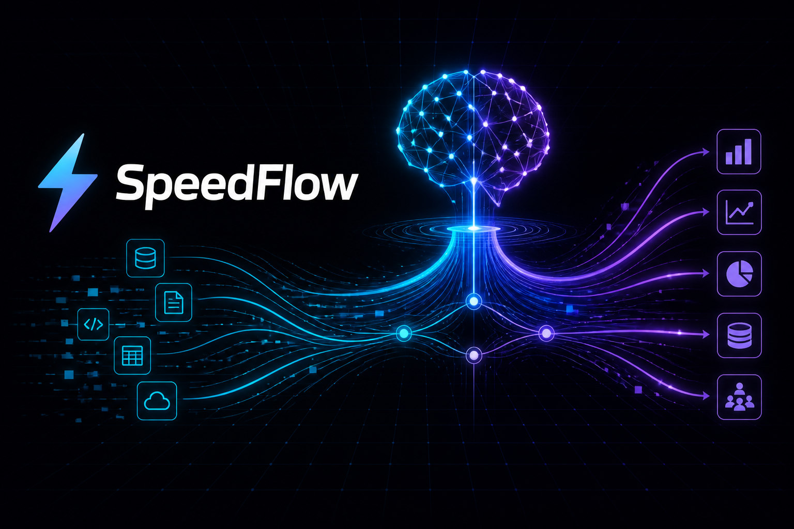
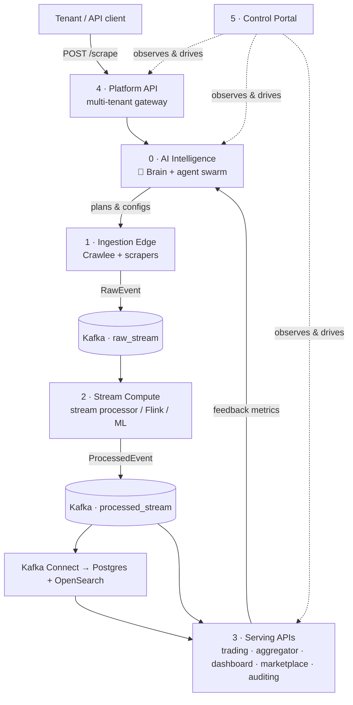
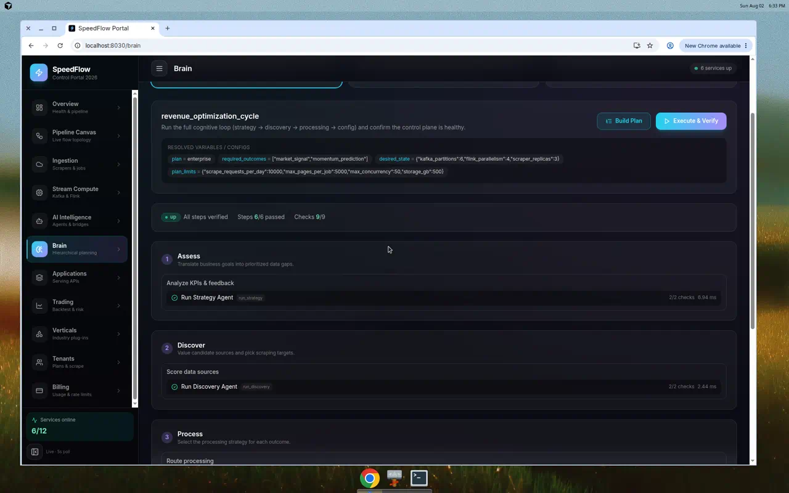

<p align="center">
  
</p>

<h1 align="center">SpeedFlow</h1>

<p align="center">
  <b>An AI-driven, multi-tenant data platform</b> that ingests web & API data, processes it in
  real time, and serves it through domain-specific apps — orchestrated by a cognitive
  <b>Brain</b> that plans, configures, and verifies the whole pipeline.
</p>

---

## What is SpeedFlow?

SpeedFlow turns raw web/API data into monetizable, domain-specific products. A swarm of AI
agents — coordinated by a hierarchical-planning **Brain** — decides *what* to scrape, *how* to
process it, and *how* to scale the infrastructure, then closes the loop using feedback from the
serving apps.

It ships with three business verticals out of the box — **Gaming & Esports**, **Financial
Markets**, and **Accommodation** — and tenants subscribe to tiered plans (`starter`, `pro`,
`enterprise`) that gate features like proxy crawling, dedicated Kafka topics, and full agent access.

### Key capabilities

- 🧠 **Agentic hierarchical planning (the Brain)** — decompose an objective into
  phases → tasks → steps, resolve the variables/configs each step needs, execute against the live
  agent swarm, and **verify every step** before moving on. See [The Brain](#-the-brain).
- 🕷️ **Adaptive ingestion** — Crawlee workers + REST/WebSocket/Selenium scrapers publish
  `RawEvent`s to Kafka (Avro on the wire via Schema Registry).
- ⚡ **Real-time stream compute** — a stream processor (Flink-equivalent MVP, plus real PyFlink
  jobs) turns `raw_stream` into enriched `processed_stream` events with rolling features & signals.
- 🏢 **Multi-tenant gateway** — subscription plans, API keys, per-tenant quotas, dedicated topics,
  metering & billing.
- 📊 **Serving apps** — trading bot, accommodation aggregator, dashboard, data marketplace, and
  auditing — all feeding metrics back into the Brain.
- 🖥️ **Control portal** — a polished React dashboard (health, live pipeline, ingestion, stream,
  agents, **Brain**, trading, verticals, tenants, billing).

---

## Architecture



**Layers:** `0-ai-intelligence` · `1-ingestion-edge` · `2-stream-compute` · `3-serving-api` ·
`4-platform-api` · `5-ui`. **Backbone:** Kafka (`raw_stream`, `processed_stream`,
`feedback_metrics`), Redis (job queues), Schema Registry (Avro), PostgreSQL, OpenSearch.

---

## 🧠 The Brain

The Brain (`0-ai-intelligence/brain/`) is an **agentic hierarchical planner**. Given a named
objective it:

1. **decomposes** the objective into a hierarchy of **phases → tasks → steps**;
2. **resolves variables & configs** for every step — clamping them to the tenant's subscription
   plan limits and applying caller overrides (`${var}` substitution);
3. **executes** each step against the live agent swarm (strategy, discovery, processing, config,
   scrape-planner) or service health checks; and
4. **verifies every step** with declarative checks *before* the next step runs, producing a full
   execution report.

<p align="center">
  
</p>

Objective templates live in [`config/brain/objectives.yaml`](config/brain/objectives.yaml) — ships
with `revenue_optimization_cycle`, `launch_scrape_pipeline`, and `onboard_vertical`.

```bash
# List objectives the Brain can plan/execute
curl -s http://localhost:8000/brain/objectives | python3 -m json.tool

# Plan + execute an objective, verifying every step
curl -s -X POST http://localhost:8000/brain/execute \
  -H 'Content-Type: application/json' \
  -d '{"objective":"revenue_optimization_cycle"}' | python3 -m json.tool
```

| Endpoint | Description |
|----------|-------------|
| `GET /brain/objectives` | List objective templates + resolved default variables |
| `POST /brain/plan` | Decompose + resolve variables/configs (no execution) |
| `POST /brain/execute` | Plan **and** run step-by-step with per-step verification |

Verifier check kinds are config-driven: `config_present`, `nonempty`, `range`, `status_up`,
`equals`, `type_is`, `truthy`. Set `"stop_on_failure": true` to halt on the first failing step
(remaining steps are marked `skipped`). Open the portal **Brain** page to run it visually.

---

## Use cases

- **Financial signals** — scrape/stream market data → `processed_stream` → trading bot emits
  momentum signals with backtesting, risk limits, and a mock broker.
- **Accommodation search** — ingest listings → serve a search/aggregator API for a travel product.
- **Gaming & esports** — live odds/stats ingestion feeding dashboards and a data marketplace.
- **Two-sided data marketplace** — tenants publish datasets and earn a revenue share on sales.
- **Self-serve SaaS** — tenants pick a plan, get metered quotas + billing, and drive AI scrapes
  from natural-language requirements.
- **Autonomous ops** — the Brain runs a full optimize→discover→process→configure→verify cycle and
  reports exactly which parts are healthy.

---

## Installation

### Prerequisites

| Requirement | Notes |
|-------------|-------|
| Docker & Docker Compose v2+ | Infra (Path A) or the full stack (Path B) |
| Python 3.11+ | Host-run apps & pipeline workers |
| Node.js 18+ | Portal web build (`5-ui/portal-web`) |
| 8 GB+ RAM | Full stack runs ~25 containers |

Optional for LLM-enhanced agents: `OPENAI_API_KEY` or `ANTHROPIC_API_KEY` in `.env` (agents fall
back to deterministic rule-based logic without keys).

### Path A — Local dev (recommended)

Docker for infra only; API, orchestrator, portal, and pipeline workers run on the host.

```bash
# 1. Configure
cp .env.example .env

# 2. One-time: install host Python deps
make install-local-deps

# 3. Build the portal UI (portal-api serves 5-ui/portal-web/dist)
npm --prefix 5-ui/portal-web install && npm --prefix 5-ui/portal-web run build

# 4. Start infra (Docker) + apps + pipeline (host)
make start-local

# 5. (optional) serving apps that back the Trading & Marketplace UI
make start-serving

# 6. Verify end-to-end
make pipeline-test     # scrape → raw_stream → processed_stream
make brain-test        # Brain: plan + execute + verify every step

# 7. Open the portal
open http://localhost:8030
```

Stop host processes with `make stop-local` (infra keeps running in Docker).

### Path B — Full Docker stack

Runs **everything** in Docker (infra + orchestrator + platform API + all serving apps + workers +
Kafka Connect + portal), Avro on the wire.

```bash
cp .env.example .env
make up            # pre-pull + sequential build, then `up -d`
make health        # wait ~60s → all services green
make connectors    # register the Postgres JDBC sink
make path-b        # full E2E: tenant → scrape → Connect → dashboard
```

Stop with `make down` (add `-v` to wipe volumes). Full command reference: `make` targets are listed
in the [Makefile](Makefile).

---

## Running & using each layer

| Layer | Path | Port | Highlights |
|-------|------|------|------------|
| AI Intelligence (+ Brain) | `0-ai-intelligence/` | 8000 | `/orchestrate`, `/brain/*`, agents & bridges |
| Ingestion Edge | `1-ingestion-edge/` | — | Crawlee workers, REST/WS/Selenium scrapers, Airflow DAGs |
| Stream Compute | `2-stream-compute/` | 8090 (ML), 8082 (Flink) | stream processor, PyFlink jobs, ML inference |
| Serving APIs | `3-serving-api/` | 8010–8014 | aggregator, trading bot, auditing, dashboard, marketplace |
| Platform API | `4-platform-api/` | 8020 | tenants, API keys, quotas, billing, `/scrape` |
| Control Portal | `5-ui/` | 8030 | React dashboard + BFF API |

### Service URLs

| Service | URL | Credentials |
|---------|-----|-------------|
| **Control Portal** | **http://localhost:8030** | — |
| Platform API | http://localhost:8020 | `X-API-Key` |
| AI Orchestrator (+ Brain) | http://localhost:8000 | — |
| Trading Bot / Marketplace | http://localhost:8011 / :8014 | — |
| Schema Registry | http://localhost:8081 | — |
| PostgreSQL | localhost:**5433** | admin / adminpassword |
| Redis | localhost:**6380** | — |
| Kafka (host) | localhost:**29092** | — |
| OpenSearch | http://localhost:9200 | no auth (dev) |

> Host-mapped ports differ from Docker-internal ports (`postgres:5432`, `redis:6379`, `kafka:9092`)
> to avoid conflicts during local dev.

### Example: submit a scrape

```bash
# Create a tenant → returns an api_key
curl -X POST http://localhost:8020/tenants \
  -H 'Content-Type: application/json' \
  -d '{"name":"Demo Corp","plan":"pro","email":"demo@example.com"}'

# Submit a natural-language scrape (the AI picks Crawlee parameters)
curl -X POST http://localhost:8020/scrape \
  -H 'X-API-Key: YOUR_KEY' -H 'Content-Type: application/json' \
  -d '{"requirement":"Scrape article titles from https://example.com","max_pages":20}'
```

Subscription tiers are defined in [`config/subscriptions/plans.yaml`](config/subscriptions/plans.yaml)
(daily quotas, proxy, dedicated topics, agent access, etc.).

---

## Testing

| Command | What it checks |
|---------|----------------|
| `make pipeline-test` | E2E scrape pipeline: tenant → scrape → `raw_stream` → `processed_stream` |
| `make brain-test` | Brain unit suite **+** live execution of every objective (verifies each step) |
| `python3 tests/test_brain.py` | Brain planner/verifier/executor unit tests (no services needed) |
| `make health` / `make path-b` | Full Docker stack health / end-to-end (Path B) |

---

## Configuration reference

| File | Controls |
|------|----------|
| `.env` | LLM keys, Kafka/Redis/Postgres URLs, proxy, budgets |
| `config/brain/objectives.yaml` | Brain objective templates (phases/tasks/steps + variables) |
| `config/subscriptions/plans.yaml` | Tenant plan limits & feature flags |
| `config/business/*.yaml` | KPIs, verticals, governance / marketplace catalog |
| `config/finops/budgets.yaml` | Daily cost caps (scrape / compute / LLM) |
| `schemas/avro/*.avsc` | Kafka event schemas (RawEvent, ProcessedEvent) |

---

## Project status & completed roadmap

The core platform is **working end-to-end** in both local dev (Path A) and full Docker (Path B).
Completed milestones: full-stack parity (Kafka Connect sinks, OpenSearch indexing, all serving apps
green), a production-grade data plane (PyFlink jobs, Airflow DAGs, per-tenant topics, observability),
enterprise features (Terraform/EKS/MSK modules, ArgoCD GitOps, OAuth2/RBAC, Stripe-backed
marketplace, billing/metering, secrets management, DR/MirrorMaker), a self-serve product layer
(billing UI, vertical plug-ins, trading backtesting, dataset revenue-share, installable PWA), and
the new **agentic Brain** (hierarchical planning + per-step verification).

## Future plans

- **Real market data in the Brain loop** — drive the trading bot's backtests from
  `processed_events`/OpenSearch with walk-forward and multi-strategy comparison.
- **Deeper Brain autonomy** — let the Brain auto-remediate failed steps, re-plan on failure, and
  persist execution reports for historical analysis and drift detection.
- **Live broker integration** — paper-trading API behind `BROKER_PROVIDER` with order
  reconciliation and Postgres-persisted positions.
- **Marketplace payouts** — Stripe Connect transfers, publisher earnings dashboard, sample previews.
- **Billing hardening** — Stripe subscriptions with proration, dunning, and invoice PDF export.
- **Rate-limit enforcement** — `429` + `Retry-After` per plan tier, per-endpoint counters.
- **PWA push + offline** — Web Push job/quota alerts and offline read-only mode with background sync.
- **Observability for new surfaces** — Prometheus metrics + Grafana panels for Brain runs,
  backtests, datasets sold, and rate-limit utilization.

---

## License

See the repository license file (if present). This project is under active development; APIs and
schemas may change.
